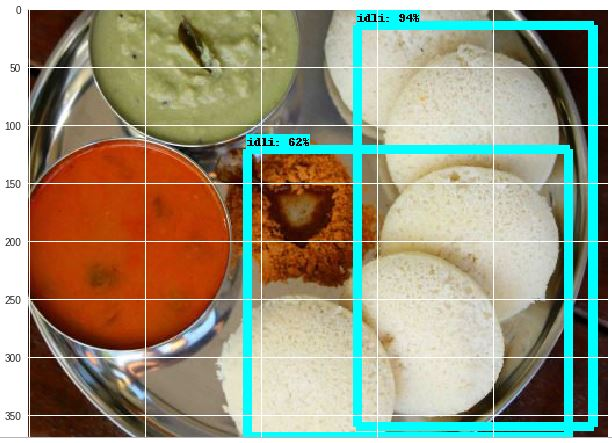

# object_detection
Food detection using google object detection run on google colab

We will build a simple object detection tool to determine the Indian food on the image.

**Food classes/yypes considered:**
Idli 
Dosa

For this we will be using google's object detection API
https://github.com/tensorflow/models/tree/master/research/object_detection

**Data set for transfer learning:**

Used ssd_inception_v2_coco model, since it provides a relatively good trade-off between performance and speed, however there are a number of other models you can use, all of which are listed in below URL

https://github.com/tensorflow/models/blob/master/research/object_detection/g3doc/detection_model_zoo.md#coco-trained-models-coco-models

